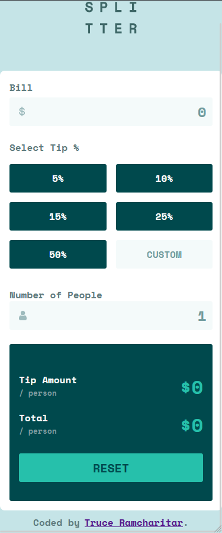

[![Contributors][contributors-icon]][contributors-link]
[![Forks][forks-icon]][forks-link]
[![Stargazers][stars-icon]][stars-link]
[![Issues][issues-icon]][issues-link]
[![MIT License][license-icon]][license-link]

<!-- PROJECT LOGO -->
 

  

<h3 align="center">Splitter Calculator App</h3>

  

    A web app for easily splitting bills, calculating individual tip amounts, and sharing costs among friends.
     
    <a href="https://github.com/DevTruce/splitter-app" target="_blank"><strong>Explore the docs »</strong></a>
     
     
    <a href="https://devtruce.github.io/splitter-app/" target="_blank">View Demo</a>
    ·
    <a href="https://github.com/DevTruce/splitter-app/issues" target="_blank">Report Bug</a>
    ·
    <a href="https://github.com/DevTruce/splitter-app/issues" target="_blank">Request Feature</a>
  

<!-- TABLE OF CONTENTS -->

  
Table of Contents

  <ol>
    <li>
      <a href="#about-the-project">About The Project</a>
      <ul>
        <li><a href="#built-with">Built With</a></li>
      </ul>
    </li>
    <li><a href="#usage">Usage</a></li>
    <li><a href="#license">License</a></li>
    <li><a href="#contact">Contact</a></li>
    <li><a href="#acknowledgments">Acknowledgments</a></li>
  </ol>

<!-- ABOUT THE PROJECT -->

## About The Project

[![Splitter Desktop App][product-screenshot1]](product-link)

  

Splitter Calculator is a user-friendly web app that allows you to input the total bill amount, select a tip percentage, or enter a custom tip, and specify the number of people sharing the bill. It then calculates the individual tip amount and total bill amount per person, making it simple to divide costs and share expenses with friends or colleagues. Whether you're dining out, traveling, or managing household expenses.

**Key Features:**

- Calculate individual tip amounts and total bill per person effortlessly.  
- Choose from preset tip percentages or enter a custom tip.  
- Easily adjust the number of people sharing the bill.  
- User-friendly interface for a smooth experience.

(<a href="#readme-top">back to top</a>)

### Built With

- [![HTML5][html5-icon]][html5-link]
- [![CSS3][css3-icon]][css3-link]
- [![SASS][sass-icon]][sass-link]
- [![JavaScript][JavaScript-icon]][JavaScript-link]

(<a href="#readme-top">back to top</a>)

<!-- ACKNOWLEDGMENTS -->

## Acknowledgments

- [MDN Documentation](https://developer.mozilla.org/en-US/)
- [Frontend Mentor](https://www.frontendmentor.io/profile/DevTruce)

(<a href="#readme-top">back to top</a>)

<!-- CONTACT -->

## Contact

Email: [DevTruce@Gmail.com]()

Discord: [xzypher.]()

(<a href="#readme-top">back to top</a>)

<!-- USAGE EXAMPLES -->

## Usage

You can use this project for anything if you would like, It is a fem challenge that I completed and I might add onto it in the future.

(<a href="#readme-top">back to top</a>)

<!-- LICENSE -->

## License

Distributed under the MIT License. See `LICENSE.txt` for more information.

(<a href="#readme-top">back to top</a>)

<!-- #### MARKDOWN LINKS & IMAGES #### -->

<!-- ## GitHub ##-->
<!-- links -->

[contributors-link]: https://github.com/DevTruce/splitter-app/graphs/contributors
[forks-link]: https://github.com/DevTruce/splitter-app/network/members
[stars-link]: https://github.com/DevTruce/splitter-app/stargazers
[issues-link]: https://github.com/DevTruce/splitter-app/issues
[license-link]: https://github.com/DevTruce/splitter-app/blob/master/LICENSE.txt

<!-- icons -->

[contributors-icon]: https://img.shields.io/github/contributors/DevTruce/splitter-app.svg?style=for-the-badge
[forks-icon]: https://img.shields.io/github/forks/DevTruce/splitter-app.svg?style=for-the-badge
[stars-icon]: https://img.shields.io/github/stars/DevTruce/splitter-app.svg?style=for-the-badge
[issues-icon]: https://img.shields.io/github/issues/DevTruce/splitter-app.svg?style=for-the-badge
[license-icon]: https://img.shields.io/github/license/DevTruce/splitter-app.svg?style=for-the-badge

<!-- ## Project ## -->

[product-screenshot1]: src/imgs/desktop.png
[product-screenshot2]: src/imgs/mobile.png
[product-link]: https://devtruce.github.io/splitter-app/

<!-- ## Tech & Tools ## -->
<!-- links -->

[html5-link]: https://html-icon/
[css3-link]: https://css3-icon/
[sass-link]: https://sass-lang.com/
[bootstrap-link]: https://getbootstrap-icon
[javascript-link]: https://www.javascript-icon/

<!-- icons -->

[html5-icon]: https://img.shields.io/badge/HTML5-orange?style=for-the-badge&logo=html5&logoColor=white
[css3-icon]: https://img.shields.io/badge/CSS3-blue?style=for-the-badge&logo=CSS3&logoColor=white
[sass-icon]: https://img.shields.io/badge/SASS-AA77FF?style=for-the-badge&logo=SASS&logoColor=white
[javascript-icon]: https://img.shields.io/badge/Javascript-FCE22A?style=for-the-badge&logo=javascript&logoColor=black
