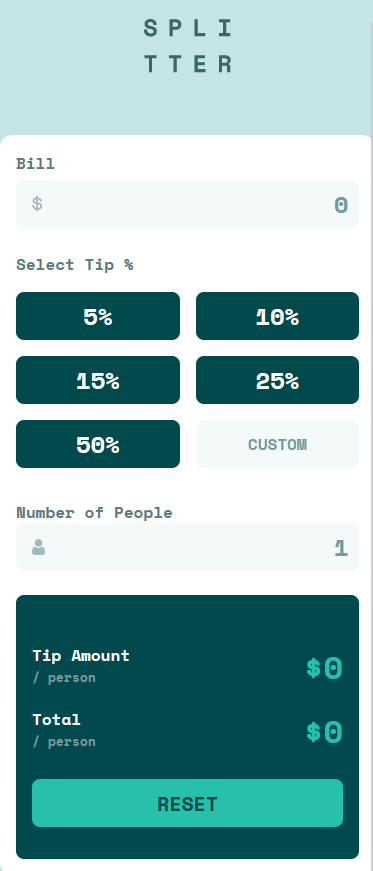

[![Contributors][contributors-icon]][contributors-link]
[![Forks][forks-icon]][forks-link]
[![Stargazers][stars-icon]][stars-link]

<!-- PROJECT LOGO -->
 

  

<h3 align="center">Splitter Calculator App</h3>

  

    A web app for easily splitting bills, calculating individual tip amounts, and sharing costs among friends.
     
     
    <a href="https://devtruce.github.io/splitter-app/" target="_blank">View Demo</a>
  

<!-- ABOUT THE PROJECT -->

## Screenshots

[![Splitter Desktop App][product-screenshot1]](product-link)

  

(<a href="#readme-top">back to top</a>)

### Built With

- [![HTML5][html5-icon]][html5-link]
- [![CSS3][css3-icon]][css3-link]
- [![SASS][sass-icon]][sass-link]
- [![JavaScript][JavaScript-icon]][JavaScript-link]

(<a href="#readme-top">back to top</a>)

<!-- CONTACT -->

## Contact

Email: [DevTruce@Outlook.com]()

Discord: [xzypher.]()

(<a href="#readme-top">back to top</a>)

<!-- #### MARKDOWN LINKS & IMAGES #### -->

<!-- ## GitHub ##-->
<!-- links -->

[contributors-link]: https://github.com/DevTruce/splitter-app/graphs/contributors
[forks-link]: https://github.com/DevTruce/splitter-app/network/members
[stars-link]: https://github.com/DevTruce/splitter-app/stargazers

<!-- icons -->

[contributors-icon]: https://img.shields.io/github/contributors/DevTruce/splitter-app.svg?style=for-the-badge
[forks-icon]: https://img.shields.io/github/forks/DevTruce/splitter-app.svg?style=for-the-badge
[stars-icon]: https://img.shields.io/github/stars/DevTruce/splitter-app.svg?style=for-the-badge

<!-- ## Project ## -->

[product-screenshot1]: src/imgs/desktop.png
[product-screenshot2]: src/imgs/mobile.png
[product-link]: https://devtruce.github.io/splitter-app/

<!-- ## Tech & Tools ## -->
<!-- links -->

[html5-link]: https://html-icon/
[css3-link]: https://css3-icon/
[sass-link]: https://sass-lang.com/
[javascript-link]: https://www.javascript-icon/

<!-- icons -->

[html5-icon]: https://img.shields.io/badge/HTML5-orange?style=for-the-badge&logo=html5&logoColor=white
[css3-icon]: https://img.shields.io/badge/CSS3-blue?style=for-the-badge&logo=CSS3&logoColor=white
[sass-icon]: https://img.shields.io/badge/SASS-AA77FF?style=for-the-badge&logo=SASS&logoColor=white
[javascript-icon]: https://img.shields.io/badge/Javascript-FCE22A?style=for-the-badge&logo=javascript&logoColor=black
